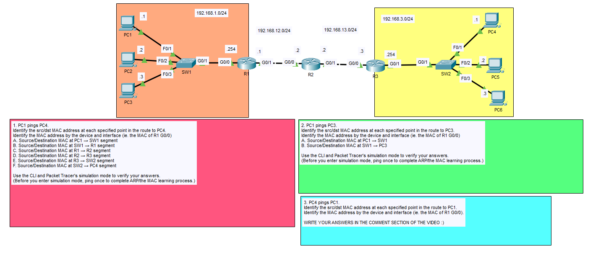
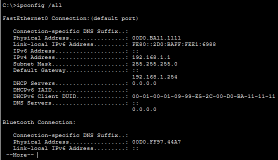
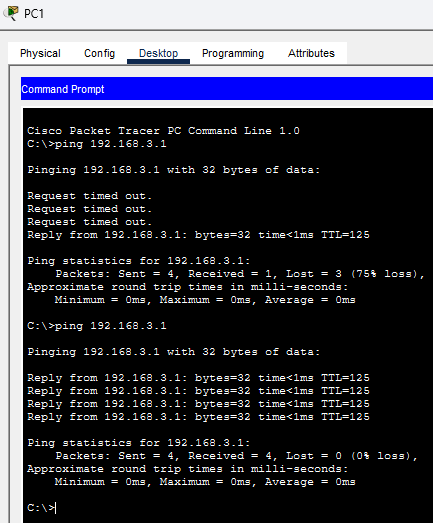
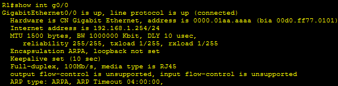
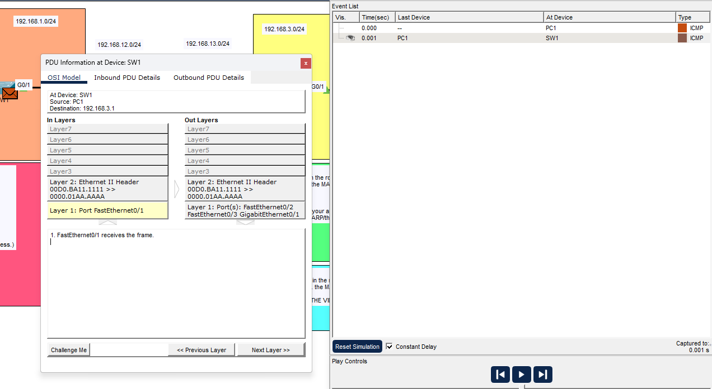
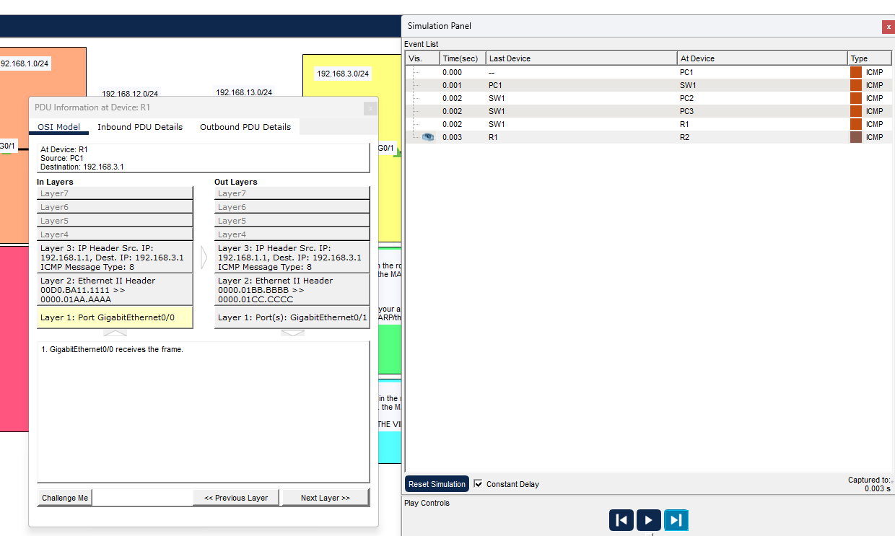
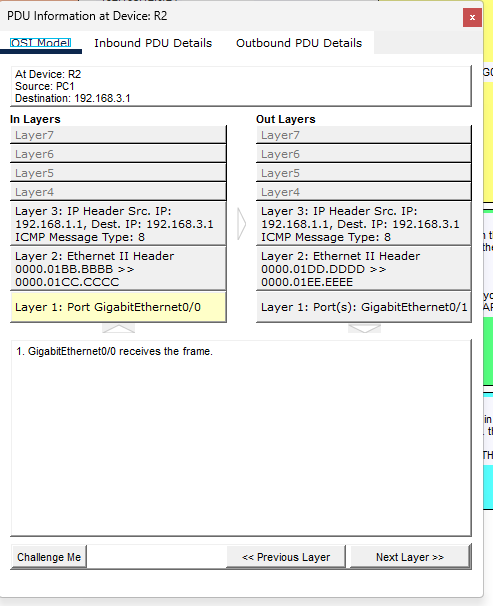
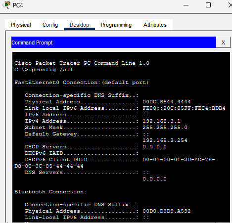
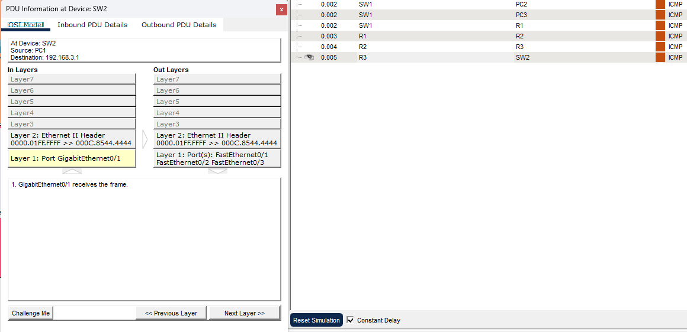
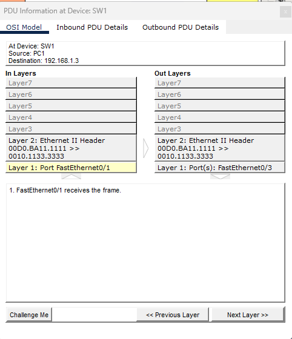

# CCNA Day 12 Lab – Multi-Router ICMP Path Tracing & MAC Address Mapping

---

## Overview

This lab focuses on tracing exactly how a frame's source and destination MAC addresses change at every hop as a packet crosses multiple Layer 2 broadcast domains, while the Layer 3 IP addresses stay constant end-to-end. A three-router, two-switch topology spans two LANs (`192.168.1.0/24`, `192.168.3.0/24`) connected over two point-to-point WAN links (`192.168.12.0/24`, `192.168.13.0/24`). The CLI was used to establish ground-truth IP and MAC addresses for every device, then Packet Tracer's Simulation Mode was used to step through real ICMP echo requests frame-by-frame, capturing the Ethernet II header at every segment between source and destination.

---

## Environment

| Tool | Purpose |
|------|---------|
| Cisco Packet Tracer | Network simulation and Layer 2/Layer 3 tracing practice |
| Cisco Routers (x3) | R1, R2, R3 — inter-network routing across two WAN links |
| Cisco Switches (x2) | SW1, SW2 — LAN switching on each side of the topology |
| PCs (x6) | PC1–PC6 — end user workstations, static IP addressing |
| Packet Tracer Simulation Mode | Frame-by-frame OSI model inspection (Inbound/Outbound PDU Details) |
| GitHub | Documentation and version control |

---

## Network Topology

*The full lab topology — three routers, two switches, six PCs across two LANs — with the three assigned ping scenarios.*

---

## IP / MAC Reference

| Device | Interface | IP Address | MAC (BIA, from `show int`) |
|---|---|---|---|
| PC1 | FastEthernet0 | 192.168.1.1 /24 | `00D0.BA11.1111` |
| PC3 | FastEthernet0 | 192.168.1.3 /24 | `0010.1133.3333` |
| PC4 | FastEthernet0 | 192.168.3.1 /24 | `000C.8544.4444` |
| R1 | G0/0 | 192.168.1.254 /24 | `00D0.FF77.0101` |
| R1 | G0/1 | 192.168.12.1 /24 | `00D0.FF77.0102` |
| R2 | G0/0 | 192.168.12.2 /24 | `0001.4220.A501` |
| R2 | G0/1 | 192.168.13.2 /24 | `0001.4220.A502` |
| R3 | G0/0 | 192.168.13.3 /24 | `0010.11E1.2301` |
| R3 | G0/1 | 192.168.3.254 /24 | `0010.11E1.2302` |

> **Note on MAC discrepancy:** Packet Tracer's Simulation Mode displays a separate, auto-generated simulation MAC (pattern `0000.01xx.xxxx`) in the PDU/OSI inspector, distinct from the physical burned-in address (BIA) reported by `show interfaces` on the CLI. The BIA table above is the CLI ground truth used to identify which device owns which interface; the simulation MACs in the tables below are what Packet Tracer actually places in the Ethernet II header during the simulated ping, and are what the lab's MAC-mapping questions are testing.

---

## MAC Address Map — Scenario 1: PC1 → PC4 (Cross-Network)

| Segment | Source MAC | Destination MAC |
|---|---|---|
| A. PC1 → SW1 | `0000.01AA.AAAA` (PC1) | `0000.01BB.BBBB` (R1 G0/0) |
| B. SW1 → R1 | `0000.01AA.AAAA` (PC1) | `0000.01BB.BBBB` (R1 G0/0) |
| C. R1 → R2 | `0000.01BB.BBBB` (R1 G0/1) | `0000.01DD.DDDD` (R2 G0/0) |
| D. R2 → R3 | `0000.01DD.DDDD` (R2 G0/1) | `0000.01EE.EEEE` (R3 G0/0) |
| E. R3 → SW2 | `0000.01FF.FFFF` (R3 G0/1) | `000C.8544.4444` (PC4) |
| F. SW2 → PC4 | `0000.01FF.FFFF` (R3 G0/1) | `000C.8544.4444` (PC4) |

## MAC Address Map — Scenario 2: PC1 → PC3 (Same-Subnet)

| Segment | Source MAC | Destination MAC |
|---|---|---|
| A. PC1 → SW1 | `00D0.BA11.1111` (PC1) | `0010.1133.3333` (PC3) |
| B. SW1 → PC3 | `00D0.BA11.1111` (PC1) | `0010.1133.3333` (PC3) |

---

## Build Walkthrough

---

### ✅ Step 1 — Verified IP Configuration on All End Hosts

Ran `ipconfig /all` on PC1, PC3, and PC4 to confirm assigned IP address, subnet mask, default gateway, and MAC address for each host before any traffic was generated. This established the ground truth used later to identify devices inside the Simulation Mode PDU traces.

---

### ✅ Step 2 — Confirmed Router Interface Addressing via CLI

Ran `show int g0/0` and `show int g0/1` on R1, R2, and R3 (entering privileged EXEC with `en` on R3) to confirm the IP address and burned-in MAC address assigned to every routed interface along the path — R1 (`192.168.1.254`, `192.168.12.1`), R2 (`192.168.12.2`, `192.168.13.2`), and R3 (`192.168.13.3`, `192.168.3.254`). Results for all six interfaces are summarized in the IP/MAC Reference table above; one representative `show int` capture is included as evidence below.

---

### ✅ Step 3 — Sent Priming Pings to Populate ARP and MAC Tables

Sent one real-time ping from PC1 to PC4 and one from PC1 to PC3 before entering Simulation Mode. The first attempt to each destination showed request timeouts while ARP resolved; the second attempt showed 0% loss. This step is required — without it, the first Simulation Mode capture shows ARP broadcast traffic instead of clean ICMP framing.

---

### ✅ Step 4 — Traced PC1 → PC4 Frame-by-Frame in Simulation Mode

Entered Simulation Mode, filtered to ICMP, and re-sent the ping from PC1 to PC4. Stepped through the event list and opened the OSI Model tab at each intermediate device — SW1, R1, R2, R3, SW2 — reading the Inbound/Outbound Ethernet II header at every hop. Recorded the source/destination MAC pair across all six segments and cross-referenced each MAC against the CLI BIA table from Step 2 to map simulation MACs back to physical device identity.

Across all six segments, the source/destination **IP** stayed fixed at `192.168.1.1 → 192.168.3.1`, while the source/destination **MAC** pair changed at every router boundary — three full rewrites for a three-router path. Switches forward the frame unchanged at Layer 2, so the MAC pair is identical on both sides of a switch; only routers strip and rebuild the Layer 2 header when routing a packet out a different interface.

*PC1's `ipconfig /all` output confirming IP 192.168.1.1/24, gateway 192.168.1.254, and MAC 00D0.BA11.1111.*

*The priming ping to PC4 — first attempt shows timeouts during ARP resolution, second attempt shows 0% loss.*

*`show int g0/0` on R1, confirming IP 192.168.1.254/24 — representative of the `show interfaces` verification repeated on all six routed interfaces (R1, R2, R3) against the IP/MAC Reference table above.*

*Simulation Mode OSI Model inspector at SW1, showing the Ethernet II header as the frame is forwarded out FastEthernet0/2, FastEthernet0/3, and GigabitEthernet0/1.*

*PDU inspector at R1 showing the Layer 3 IP header unchanged (192.168.1.1 → 192.168.3.1) while the Layer 2 Ethernet II header is rewritten on the outbound side.*

*PDU inspector at R2 confirming the IP header passes through unmodified at Layer 3, while the Ethernet II header is rewritten again on the outbound side.*

*PC4's `ipconfig /all` output confirming IP 192.168.3.1/24, gateway 192.168.3.254, and MAC 000C.8544.4444 — the final destination MAC for the trace.*

*PDU inspector at SW2 showing the final Ethernet II header as the frame is forwarded out F0/1, F0/2, and F0/3 toward PC4.*

---

### ✅ Step 5 — Traced PC1 → PC3 Frame-by-Frame as a Same-Subnet Control Case

Re-sent a ping from PC1 to PC3 — a device on the same `192.168.1.0/24` subnet and the same switch — in Simulation Mode. Opened the OSI Model PDU inspector at SW1 to capture the Ethernet II header as the frame entered on FastEthernet0/1 and was forwarded out FastEthernet0/3, confirming no Layer 3 routing occurred and R1 was never involved.

The source/destination MAC pair was identical on both segments (PC1→SW1 and SW1→PC3) — direct proof that a Layer 2 switch never modifies a frame's MAC header, it only reads the destination MAC to decide which port to forward out. This is the control case against Step 4: routing rewrites MAC addresses at every hop, but pure switching never does.

*PDU inspector at SW1 for the PC1→PC3 ping, showing identical source/destination MAC (00D0.BA11.1111 → 0010.1133.3333) on both sides since no router is involved.*

---

### ✅ Step 6 — Traced PC4 → PC1 as a Reverse-Path Control Case

Initiated a ping from PC4 back to PC1 across the same three-router path, stepping through PC4 → SW2 → R3 → R2 → R1 → SW1 → PC1 in Simulation Mode. Compared each segment's MAC pair against the corresponding forward-direction segment from Step 4 to confirm that source and destination roles simply swap, while each router's per-interface MAC stays fixed regardless of traffic direction.

The IP header showed source `192.168.3.1` and destination `192.168.1.1` consistently end-to-end, mirroring Step 4's IP behavior in reverse. Per the original assignment, detailed answers for this direction were submitted separately rather than captured as additional screenshots.

---

## Skills Demonstrated

| Skill | How It Was Applied |
|-------|--------------------|
| OSI Layer 2 vs Layer 3 Separation | Traced how IP addresses remain constant end-to-end while MAC addresses are rewritten at every router hop |
| ARP / MAC Address Resolution | Used priming pings before each simulation capture to force ARP resolution ahead of clean ICMP framing |
| Cisco IOS CLI Navigation | Used `show interfaces`, privileged EXEC mode, and per-interface detail commands across three routers |
| Windows-Style Host CLI | Used `ipconfig /all` and `ping` on PC1, PC3, and PC4 to establish ground-truth IP/MAC bindings |
| Packet Tracer Simulation Mode | Used the Event List and per-device OSI Model/PDU Details panes to step through a live ICMP exchange frame-by-frame |
| Switching vs. Routing Analysis | Directly contrasted intra-subnet (MAC-preserving) traffic against inter-subnet (MAC-rewriting) traffic using the same source host |
| Structured Technical Documentation | Organized multi-hop MAC findings into per-segment tables tied back to verified CLI interface data |

---

## Lessons Learned

**IP and MAC addressing solve two different problems, and watching them diverge in real time makes that obvious.** IP addressing gives every host a structured, hierarchical identity that survives the entire trip from source to destination unmodified. But IP alone can't get a frame across a physical wire — that's a Layer 2 problem, and Layer 2 only understands who's on this particular segment right now. Watching the same ICMP echo request's IP header stay frozen at `192.168.1.1 → 192.168.3.1` for all six segments, while the MAC header was torn down and rebuilt three separate times, made the abstraction concrete in a way that reading about encapsulation never quite does. Each router isn't really "forwarding a packet" so much as it's receiving a frame, discarding its Layer 2 wrapper entirely, deciding the next hop via its routing table, and constructing a brand-new frame with its own outbound interface as the new source MAC.

**Comparing a same-subnet trace against a cross-subnet trace was more useful than either trace alone.** It would be easy to assume MAC rewriting is just something that happens during a ping, but the PC1→PC3 trace proved that's wrong — when both hosts share a subnet, the exact same source and destination MAC addresses survived the entire trip, because a switch never touches the Layer 2 header it's forwarding; it only reads the destination MAC to make a forwarding-table lookup. Switches read and forward, routers read, strip, and rebuild — and that distinction only became obvious from the side-by-side comparison.

**Reading simulator output critically instead of trusting it blindly is its own skill.** The CLI's `show interfaces` output reported each router's burned-in address using one MAC format, while Packet Tracer's Simulation Mode PDU inspector displayed a different MAC for the same interface during the actual frame trace. Recognizing that as a known characteristic of how the simulation engine generates its own internal MAC representation — rather than assuming the lab was broken — is the same cross-referencing discipline used in real troubleshooting: checking whether a discrepancy is a configuration error, a tool quirk, or a genuine fault.

---

## 💼 Real-World Application

Tracing how addressing changes hop-by-hop is exactly what a network engineer does when isolating where a connectivity problem actually lives. If a ping fails partway through a path, knowing that IP addresses stay constant but MAC addresses are local to each segment tells you immediately whether to look at ARP tables, routing tables, or switch MAC tables for the failure. This same Simulation Mode / CLI cross-referencing workflow — verify interface addressing first, then trace the actual frame — is the foundation of packet-level troubleshooting on production gear, not just a Packet Tracer exercise.

---

## References

- [Jeremy's IT Lab — The Life of a Packet | Day 12 | CCNA 200-301 Complete Course](https://www.youtube.com/watch?v=4YrYV2io3as)
- [Jeremy's IT Lab — Full CCNA Course](https://www.youtube.com/playlist?list=PLxbwE86jKRgMpuZuLBivzlM8s2Dk5lXBQ)
- [Cisco — Understanding ARP (Address Resolution Protocol)](https://www.cisco.com/c/en/us/support/docs/ip/address-resolution-protocol-arp/13718-5.html)
- [Cisco — IP Routing: Protocol-Independent Configuration Guide](https://www.cisco.com/c/en/us/td/docs/ios-xml/ios/iproute_pi/configuration/xe-16/irp-xe-16-book.html)
- [Cisco — `show interfaces` Command Reference](https://www.cisco.com/c/en/us/td/docs/ios-xml/ios/fundamentals/command/reference/cf_command_ref/sh_a1-sh_az.html)
- [Cisco Networking Academy — Packet Tracer](https://www.netacad.com/courses/packet-tracer)
- [IETF RFC 826 — An Ethernet Address Resolution Protocol (ARP)](https://datatracker.ietf.org/doc/html/rfc826)
- [IETF RFC 792 — Internet Control Message Protocol (ICMP)](https://datatracker.ietf.org/doc/html/rfc792)
